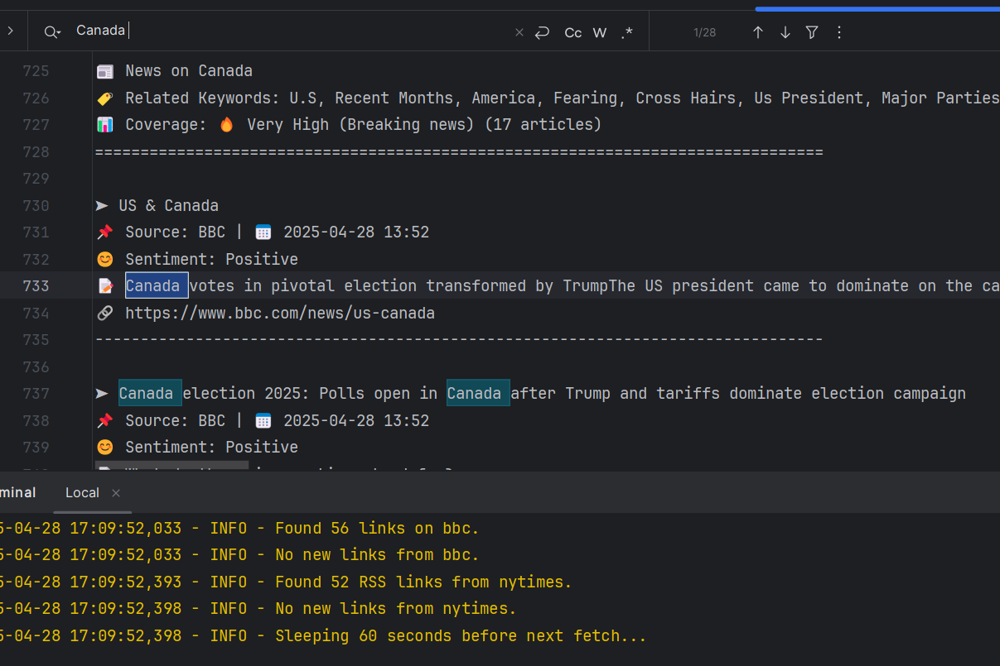

# NewsMeUp!

This is a personal project. I had a hard time keeping up with so many news sources, and honestly, I'm too lazy to read everything.
This tool fetches, summarizes recent news, and sends the updates to my phone (via Email or Push Notification).
You can add more news channels if you want, but I'm only interested in the ones currently set.

## Clustering
It automatically clusters your final summaries — meaning it intelligently sorts the news using machine learning techniques.
You get a clean, organized text file without manually grouping similar articles.




---
## 📦 Installation

```bash
git clone https://github.com/GittyCandy/NewsMeUp.git
pip install -r requirements.txt

(individually run pip install "lxml[html_clean]" if error occurs)

```

## How to Run?

python NewsMeUp.py --export news.csv

(Adjust the running Script According to your prefference by)

```
python NewsMeUp.py --help

```

---
